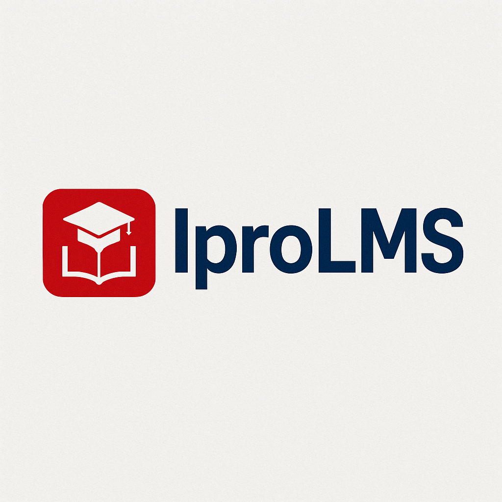

  

  
  
  
  

## О IproLMS

IproLMS – это современная система управления обучением (Learning Management System), которая призвана сделать процесс онлайн-образования доступным, эффективным и увлекательным. Платформа IproLMS упрощает создание, администрирование и проведение курсов, предоставляя разработчикам и преподавателям мощные инструменты для:

- [Управления курсами и расписаниями](https://iproLMS.example.com/docs/courses).
- [Анализа успеваемости обучающихся](https://iproLMS.example.com/docs/analytics).
- [Интерактивного взаимодействия с аудиторией](https://iproLMS.example.com/docs/interactions).
- [Создания адаптивных и персонализированных учебных программ](https://iproLMS.example.com/docs/curriculum).
- [Масштабирования образовательных проектов](https://iproLMS.example.com/docs/scalability).

IproLMS интуитивно понятен и функционален, обеспечивая всё необходимое как для крупных образовательных учреждений, так и для индивидуальных преподавателей.

## Изучение IproLMS

Платформа предлагает обширную и тщательно проработанную [документацию](https://iproLMS.example.com/docs) с подробными руководствами по началу работы и освоению всех функциональных возможностей системы.

Кроме того, вы можете пройти [IproLMS Bootcamp](https://iproLMS.example.com/bootcamp), где вас шаг за шагом проведут через процесс создания полноценного онлайн-курса.

Для тех, кто предпочитает обучение через видео, [IproLMS Academy](https://iproLMS.example.com/academy) содержит сотни обучающих роликов по разработке курсов, управлению обучением, использованию современных технологий и другим актуальным темам.

## Партнёры IproLMS

Мы благодарны следующим партнёрам за поддержку и развитие IproLMS. Если вы заинтересованы в партнёрстве, пожалуйста, посетите раздел [IproLMS Partners](https://iproLMS.example.com/partners).

### Премиум партнёры

- **[EduTech](https://edutech.example.com)**
- **[LearnPro](https://learnpro.example.com)**
- **[CourseMaster](https://coursemaster.example.com)**
- **[SkillBoost](https://skillboost.example.com)**
- **[Knowledge Hub](https://knowledgehub.example.com)**

## Вклад в развитие

Мы рады вашему интересу к участию в развитии IproLMS! Руководство по внесению изменений и предложений можно найти в [разделе документации по вкладу](https://iproLMS.example.com/docs/contributions).

## Кодекс поведения

Для обеспечения дружелюбной и профессиональной атмосферы в сообществе, пожалуйста, ознакомьтесь и соблюдайте [Кодекс поведения](https://iproLMS.example.com/docs/contributions#code-of-conduct).

## Сообщения о проблемах безопасности

Если вы обнаружите проблему с безопасностью в IproLMS, просим вас сообщить об этом по адресу [security@iproLMS.example.com](mailto:security@iproLMS.example.com). Все найденные уязвимости будут оперативно устранены.

## Лицензия

IproLMS – это проект с открытым исходным кодом, распространяемый под [MIT лицензией](https://opensource.org/licenses/MIT).
